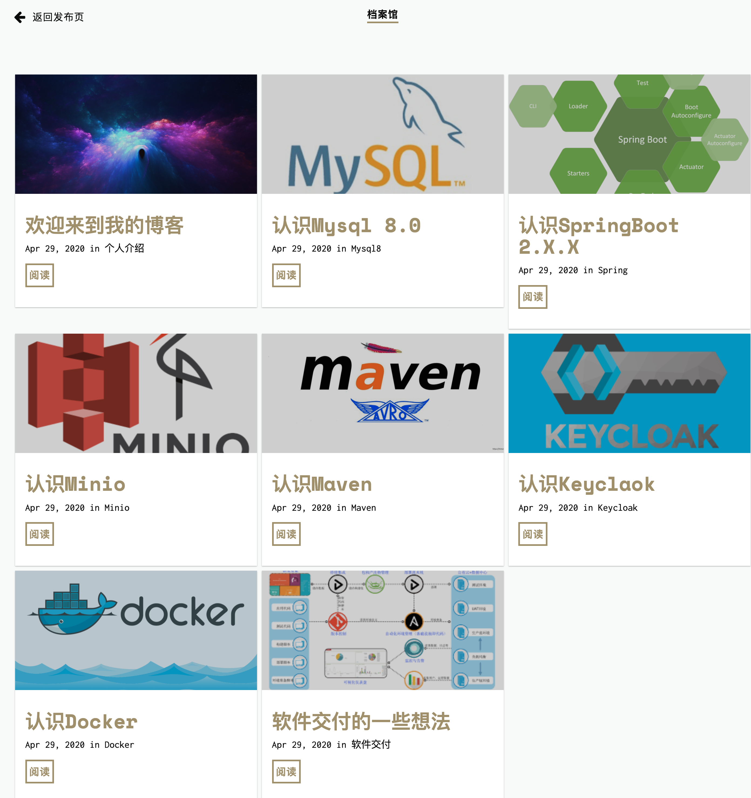
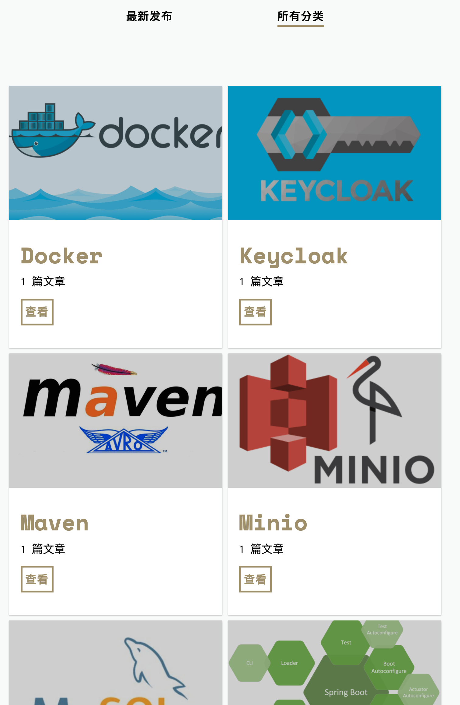

# 🏆 Leo's blog.
---
线上地址: www.lujunlei.com

## 截图
---
#### 文章发布页
---


#### 档案馆
---


#### 所有分类
---


## 安装
---
所有的依赖都在````Gemfile````. 运行 ````bundle install````安装，安装Ruby,gem,Bundle请移步Jekyll官网，有安装说明；

### _config.yml
---
- 相关数据配置

### _posts
---
- 日记内容
